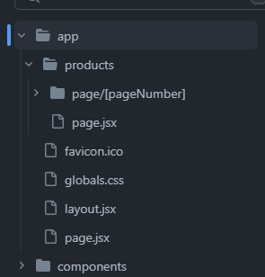

# Server Side Pagination

If you are looking for a pagination for your **Next JS** application that will help you to achieve a url structure like `www.xyz.com/products/page/1, www.xyz.com/products/page/2` then you are in the right place.

**Server Side Pagination** is a pagination package that helps user to do server side pagination with **Next 13.4** and above. It uses the functionalities of latest **Next JS** and it's **App Router**. This pagination design can easily be changed with **Tailwind CSS Classes** or you can add your **Custom CSS Classes**.

## Installation

You can install **Server Side Pagination** using npm or yarn:

```bash
npm install Server Side Pagination
```

or

```bash
yarn add Server Side Pagination
```

## Usages

First create routes in your **Next JS** application like below

######



#### more usages content goes here ...

## Demo

[Live Demo](https://server-side-pagination-one.vercel.app/)

## License

This package is licensed under the MIT License. See the [LICENSE](LICENSE) file for details.

## Issues

If you encounter any issues or have questions about this package, please feel free to [open an issue](https://github.com/ihossen016/server-side-pagination/issues) on GitHub.

## Author

**Server Side Pagination** is maintained by [Ismail Hossen](https://github.com/ihossen016).

Thank you for using **Server Side Pagination**!
